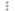
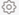

You can customize the elements, called visualizations, in a chart if you want to change how data is displayed. You have the ability to modify many visual elements including colors, labels, and chart types.

<b>Steps</b>

1.  Go to **Analytics** \> **Veracode Dashboards**.

2.  Select a visualization you want to customize.

3.  From the menu icon \(\) in the top-right corner of the visualization, click **Explore From Here**.

    The Explore page opens where you can modify the chart as needed.

4.  To modify the query used in the visualization:

    a.  Use the dropdown menus to change the dashboard query.

    For example, if you want to change the time period in the dashboard from the past year to the past 90 days, you can use the **Application Published Date** filter to change the time period from **is in the past 12 months** to **is in the past 90 days**.

    b.  Click the **Run** button in the top-right corner.

5.  To modify the chart type to a different kind of information display, under **Visualization** select the chart icon you want to use.

    The menu icon \(\) provides additional chart types.

6.  To edit the legend, colors, X and Y axis labels, or font size, click the gear icon \(\) in the top-right corner of the visualization section.

<b>Next Steps</b>

You can [save any Veracode dashboards, or any of your organization dashboards that you have customized](https://docs.veracode.com/r/t_save_dashboards), and share with others on your team.
