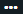

After completing a sandbox scan, you have the option to promote the sandbox scan to a policy scan that counts toward your policy compliance score. You can perform a sandbox scan as part of integration testing to validate the security of your application and, then, promote the sandbox scan to a policy scan.

<b>Before You Begin</b>

The sandbox scan you want to promote must meet these conditions:

-   The scan is the most recent.
-   The scan is no more than 60 days old.

<b>Overview</b>

Veracode recommends that you designate one sandbox to test different versions of code or components of an application. To achieve policy compliance, apply all mitigations to the scan results designated for promotion. Then, only promote scans from this sandbox.

When you promote a sandbox scan to a policy scan, Veracode applies the score of that scan against the policy. You can have multiple sandboxes to scan the different components of your application. However, when you promote a sandbox scan, that scan must contain the entire application.

Sandbox scans of individual components of an application analyze only a small part of the application. These scans do not have the full context of the application. Scans can detect findings by analyzing the interaction between files or libraries.

<b>Note:</b> Before promoting a scan, verify that you have uploaded all the modules of the full application.

<b>Steps</b>

1.  From the application overview page, click **Sandboxes** on the left navigation menu.

2.  Click the name of the sandbox you use for promotion.

3.  Click the name of the most recent scan.

    
<b>Note:</b> If the most recent scan is in progress or incomplete, you cannot promote an earlier scan from the same sandbox.

4.  Click  and select **Promote Scan**.

5.  If you want to delete this sandbox from your application upon promotion, select the **Delete Associated Sandbox** checkbox.

    Deleting the sandbox helps you avoid having an excessive number of sandboxes, which can make results difficult to review. The additional sandboxes count toward your [sandbox limit](https://docs.veracode.com/r/Start_a_Sandbox_Scan).

6.  Click **Promote** to promote the scan.

    After you promote the scan, it appears in the Policy Evaluation section of the application page and the list of completed policy scans. The name of the scan is appended with \(Promoted\) to indicate that you promoted it from a sandbox to a policy scan. All data exports include the flaw data from promoted sandbox scans. You can also view the flaw data in [Veracode Analytics](https://docs.veracode.com/r/c_about_dashboards).

<b>Results</b>

When promoting a scan, the scan shows the Promote in Progress status until the promotion finishes. The promotion might take some time, depending on the number of findings in the scan.

When performing a [rescan](https://docs.veracode.com/r/t_rescan) of a promoted scan, Veracode resets the scan status to Promote in Progress until the rescan is complete.
