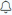

Veracode sends notifications to your email address for policy events and scan status updates relevant to your role and team membership. If three consecutive attempts to deliver these emails to you fail, Veracode blocklists your email address. If you want to continue receiving these emails from Veracode, you can remove your address from the blocklist.

<b>Steps</b>

1. In the Veracode Platform, select **Notification Settings** from the bell menu .
2. Click **Remove My Email from Blocklist**. This button does not appear if your email is not blocklisted. 
   
    A success message appears onscreen confirming that you can now receive emails from Veracode.