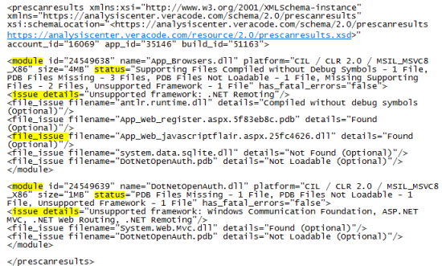

The `getprescanresults.do` call returns the `prescanresults.xml` file. This file contains three types of information about any issues with your uploaded files and modules.

**File Issues**

Provides information about the files you have uploaded. If the scan engine fails to prescan the file, it returns a fatal error. Additional information that may be provided is in the element `file_issue` and attribute `details`. Each issues states whether it is `(Required)` or `(Optional)` to fix before you can run the application scan. Examples of returned message text include:

  -   Compiled without debug symbols.
  -   Has corrupt headers.
  -   Compiled using obfuscation.

**Issue Details**

Provides you with general information about the prescan. If the prescan failed, you receive a fatal error. Additional information that may be provided is in the `module` element, as the child element `issue` and attribute `details`. Examples of these details include:

  -   No supporting files or PDB files
  -   One or more uploaded files are compiled with a compiler that is not currently supported by Veracode.
  -   One or more PHP files could not be compiled.

**Module Status**

Provides you with general information about the modules that the scan engine has prescanned. If the module upload fails, the results you receive begins with `(Fatal)` and includes the`has_fatal_errors="true"` parameter. Additional information that may be provided is in the element `module` and attribute `status`. Examples of returned message text include:

  -   JSP Compilation Errors
  -   PDB Files Not Loadable
  -   Unsupported Architecture/Platform/Compiler

