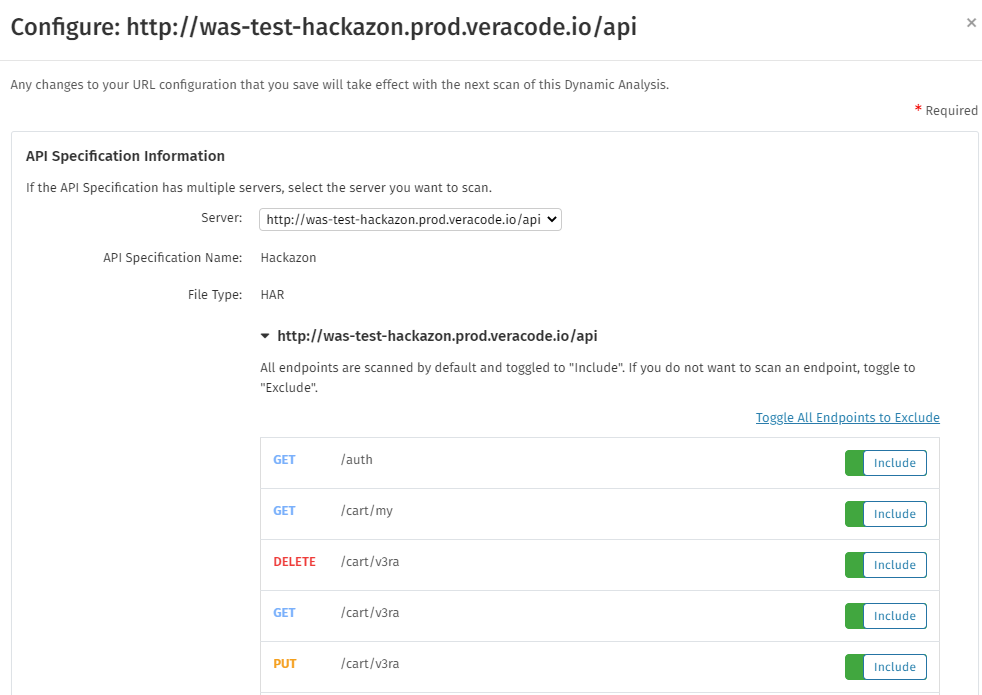

After creating an API specification scan in the Veracode Platform, you need to configure the scan with specific settings, such as the target API server, the server authentication method, and, if the server is behind a firewall, an Internal Scan Management (ISM) gateway.

<b>Before You Begin</b>

* You have a [Veracode account](https://docs.veracode.com/r/c_about_veracode_accounts) with the Creator, Submitter, or Security Lead [role](https://docs.veracode.com/r/c_role_permissions). Any member of the team associated with the Dynamic Analysis is able to view the analysis and its results.
* You have [created an API specification scan](https://docs.veracode.com/r/Create_an_API_Specification_Scan).

<b>Steps</b>

1. Log in to the Veracode Platform.
2. Select **Scans and Analysis** > **Dynamic Analysis**.
3. In the All Dynamic Analyses table, locate the row for analysis that references the API specification you want to configure.
4. In the Actions column, select **Configure Analysis**.
5. In the API Specifications to Scan table, locate the row for the specification you want to configure.
6. In the Actions column, click **Configure** (pencil icon) to open the Configure window.  
   
7. In the API Specific Information section, from the **Server** dropdown menu, select the URL of the server you want to use with this specification.

    OpenAPI 2.0 only supports a single server, while OpenAPI 3.0 and HAR files support multiple servers. You typically use these servers to select different environments, such as a production instance and a staging environment, or multiple production instances located in different regions.

8. Optionally, under the selected server URL, select the endpoints to include or exclude during scanning.

    If you uploaded a HAR file that you captured using a browser, but have not filtered the HAR file, ensure that the server hosting your APIs is selected. API Scanning attempts to select the correct server based on traffic analysis, but you must confirm that the correct server is selected.

9. In the Authentication section, select **Required** to select and configure an authentication method for accessing the selected server.
10. Under Additional Authentication Options, select the checkbox for one or more authentication options you want to use. See the table at the end of this topic for a description of each option.
11. In the Internal Scanning section, if your scan uses an internal server that is not exposed to the public internet, you can configure [Internal Scan Management (ISM)](https://docs.veracode.com/r/t_dynamic_ISM) to enable access to that server. Select a configured ISM [gateway](https://docs.veracode.com/r/c_gateway_best_practices) and [endpoint](https://docs.veracode.com/r/c_endpoint_best_practices) for accessing the server.
12. In the Advanced Options section, you can configure a custom user agent that API Scanning sends with each API request. By default, API Scanning identifies as the originator of the scan with `Veracode Security Scan/support@veracode.com`.

    Compared to the substring for web application scanning, this substring does not include browser information. You can also use this substring to exempt Web Application Firewall (WAF) blocking or suppress pager notifications in an Intrusion Prevention System (IPS). See your vendor documentation for information about the solution for your organization.

13. Under Requests Per Second, select to allow an unlimited number of API requests or enter a limit.
14. Click **Save** to save the configuration. Depending on your scan configuration, a full Dynamic Analysis or prescan runs on the specified schedule.

    
<b>Note:</b> Because API Scanning scans each API specification quickly, Veracode does not recommend pausing and resuming the analysis.

<b>Next Steps</b>

- [Review the results](https://docs.veracode.com/r/Understanding_the_DA_Coverage_Report). If you ran a prescan, see [prescan results for API Scanning](https://docs.veracode.com/r/Review_API_Scanning_Prescan_Results).
- [View historical details for a Dynamic Analysis](https://docs.veracode.com/r/View_Historical_Details_for_a_Dynamic_Analysis).

<table class="veracode">
 <thead><caption>Additional Authentication Options for API Scanning</caption>
 <tr>
 <th>Option</th>
 <th>Description</th>
 </tr>
 </thead>
 <tbody><tr>
 <td><b>Client Certificate</b></td>
 <td>Use for authenticating with servers configured with TLS authentication. API Scanning responds to any client certificate requests for certificates from a matching issuer with the configured certificate. Ensure the file format of the certificate is <code>PKCS#12</code>, which usually has a <code>.pfx</code> or <code>.p12</code> extension. Also, you must specify a passphrase for decrypting the private key in the <code>.p12</code> file.</td>
 </tr>
 <tr>
 <td><b>Basic Authentication</b></td>
 <td>Use basic and NTLMv2 authentication for authenticating with internal servers. API specifications that use basic authentication typically have <code>scheme: basic</code> defined in their OpenAPI definitions. For example, in OpenAPI 3.0: 

<code>
 components: 
 securitySchemes: 
   basicAuth: 
   type: http 
   scheme: basic   # specifies to use basic authentication. 
</code>

 </td>
 </tr>
 <tr>
 <td><b>Custom Headers</b></td>
 <td>Common type of authentication for use with Veracode API Scanning. You can define one or more <code>name/value</code> pairs. When defining the name, do not add any trailing colons. Values typically do not include a colon, but this is legal according to the RFC. You cannot use these reserved header names: 

<ul>
<li><code>Accept-Charset</code></li>
<li><code>Accept-Encoding</code></li>
<li><code>Access-Control-Request-Headers</code></li>
<li><code>Access-Control-Request-Method</code></li>
<li><code>Connection</code></li>
<li><code>Content-Length</code></li>
<li><code>Cookie</code></li>
<li><code>Cookie2</code></li>
<li><code>Date</code></li>
<li><code>DNT</code></li>
<li><code>Expect</code></li>
<li><code>Host</code></li>
<li><code>Keep-Alive</code></li>
<li><code>Origin</code></li>
<li><code>Referer</code></li>
<li><code>TE</code></li>
<li><code>Trailer</code></li>
<li><code>Transfer-Encoding</code></li>
<li><code>Upgrading</code></li>
<li><code>Via</code></li>
</ul>

 Custom headers in OpenAPI specifications use <code>apiKey</code> or <code>bearerAuth</code> security scheme types. Because authentication might occur at a different layer of the solution, such as through an API gateway, you might not need to add it to the API specification. Ensure you check with the development team that created the specification to confirm the authentication solution.  
 This example shows a custom header with the name <code>X-API-KEY</code>: 

<code>
 openapi: 3.0.0 
 ... 
 components: 
 securitySchemes: 
   ApiKeyAuth:      # arbitrary name for the security scheme 
   type: apiKey 
   in: header       # can be "header" or "cookie" 
   name: X-API-KEY  # name of the header, query parameter, or cookie 
</code>
 
This example shows a JWT bearer token: 

<code>
 openapi: 3.0.0 
 ... 
 components: 
 securitySchemes: 
   bearerAuth:  # arbitrary name for the security scheme 
   type: http 
   scheme: bearer 
   bearerFormat: JWT 
</code>
 You can configure this token as a custom header with name <code>Authorization</code> and value <code>Bearer $JWT_CONTENT</code>, where <code>$JWT_CONTENT</code> is a series of period-delimited, base64-encoded JSON fragments.
 </td>
 </tr>
 <tr>
 <td><b>OAuth 2.0</b></td>
 <td>Authenticate with servers that require the <a href="https://swagger.io/docs/specification/authentication/oauth2/">OAuth 2.0 protocol</a>. API Scanning supports both the Client Credentials and Password Credentials grant types, which you can select from the Grant Types dropdown menu. For both grant types, a scope is optional. If you need to enter multiple scope values, separate each value with a space. Veracode sends all authorization data as an HTTP Authorization Header.

If you select the <b>Client Credentials</b> grant type, you can select the <b>Use OpenID Connect</b> checkbox to use OAuth 2.0 with <a href="https://openid.net/connect/">OpenID Connect</a>. After selecting the checkbox, enter the URL for the authentication server in the OpenID Connect URL field.

 </td>
 </tr>
 </tbody>
 </table>
