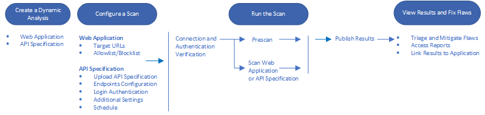

The Dynamic Analysis workflow for scanning web applications or API specifications consists of steps to configure the scan, run the scan, and view the results.

This image shows the typical Dynamic Analysis workflow:

