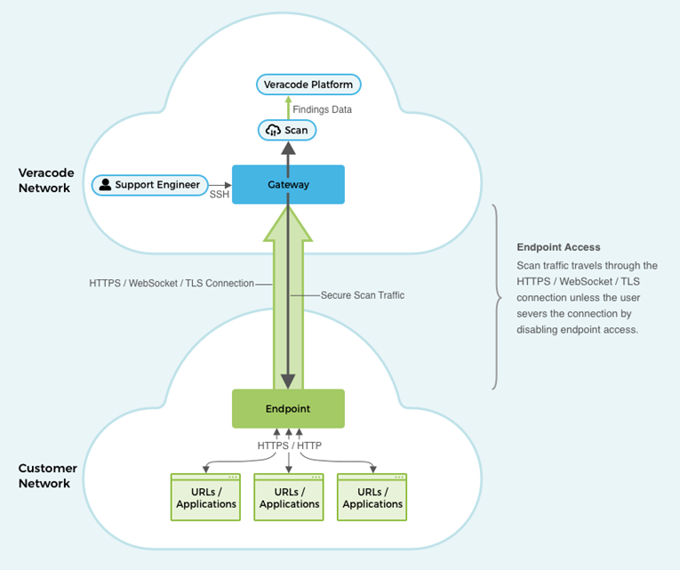

Veracode Internal Scanning Management \(ISM\) is a simplified approach to web application scanning for applications hosted within a corporate firewall that cannot be reached from the public internet. ISM allows Veracode to bring uniformity to the scanning of external and internal applications for Veracode Dynamic Analysis users.

ISM is specifically designed to not expose you to any security risks. All scanning and support occurs in the Veracode cloud, and you can disable the access between Veracode and your applications at any time. The only software you need to install in your network is a simple Java client, which authenticates with a gateway in the Veracode cloud.

ISM provides several benefits when scanning your internal applications, such as:

**Usability**

- You can configure your ISM project within a [single, simple workflow](https://docs.veracode.com/r/t_configure_gateway).
- You can [configure Veracode Dynamic Analysis scans](https://docs.veracode.com/r/c_was_configure) for your internal applications in the same way that you do for external applications.
- ISM does not restrict where you can host your internal applications. With ISM you can perform scans of applications hosted in containers, virtual machines, bare-metal servers, or in the cloud.

**Compliance**

- With ISM you have full control of your environment. You can grant and revoke Veracode access to scan or provide support for your applications.
- The only software you need to maintain is a JAR file that you run in your environment.

**Stability**
   
ISM does not require you to regularly update any software, eliminating the need for reboots and extensive downtime.

**Scalability**
  
You can run several scans simultaneously on a single ISM deployment.

