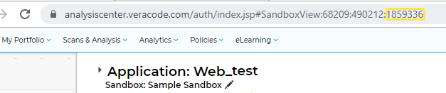
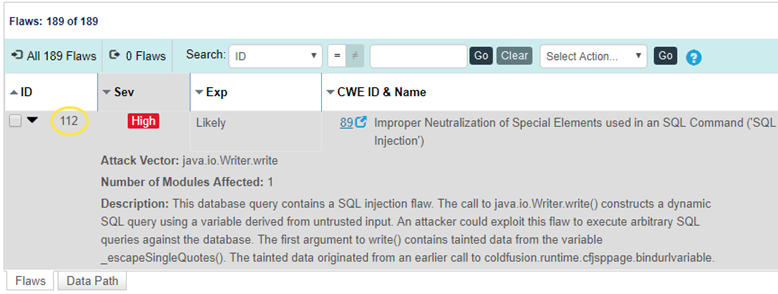
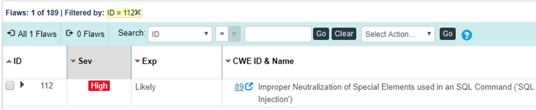

You can provide a URL directly to the latest instance of a flaw to save your team the time of navigating through the Veracode Platform to find it.

<p font-size="13pt"><b>Overview</b></p>

To link directly to the latest instance of a flaw, create a URL using this template:

```
https://analysiscenter.veracode.com/auth/index.jsp#ReviewResultsFlaw:{account_ID}:{application_ID}:{sandbox_ID}:{flaw_ID}
                    
```

To provide the accurate URL, you must know the account ID, application ID, sandbox ID, and flaw ID.

<p font-size="13pt"><b>Steps</b></p>

1.  To find the account ID, open the application overview page and, from the URL, copy the ID number that immediately follows `https://analysiscenter.veracode.com/auth/index.jsp#HomeAppProfile:`

    

2.  To find the application ID, open the application overview page and, from the URL, copy the ID number that follows the account ID.

    

3.  To find the sandbox ID, open a specific sandbox for the application and copy the ID number at the end of the URL. If the finding is from a policy scan, the sandbox ID is 0.

    

4.  To find the flaw ID, open the Triage Flaws page and copy the ID of the flaw found in your scan.

    

5.  After collecting the necessary IDs, insert them into the URL template for linking to the latest instance of a flaw: `https://analysiscenter.veracode.com/auth/index.jsp#ReviewResultsFlaw:{account_ID}:{application_ID}:{sandbox_ID}{flaw_ID}:`

    This URL opens the Triage Flaws page for the specified sandbox, filtered by flaw ID to show the most recent instance of the flaw being found in a scan.

    

<p font-size="13pt"><b>Next Steps</b></p>

You can share this URL with members of your team involved in triage and remediation to allow more convenient, direct access to the specific flaw.

