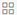

Veracode provides answers to Veracode Analytics frequently asked questions.

**What data can I see in Veracode Analytics?**

Veracode Analytics includes data from:

-   Static Analysis
-   Dynamic Analysis scans linked to applications
-   Manual Penetration Testing
-   Veracode Software Composition Analysis

Veracode Analytics does not currently include data from:

-   Veracode eLearning
-   Discovery
-   Dynamic Analysis scans not linked to applications

You can view Veracode Analytics data only for applications to which you have access in the Veracode Platform. Veracode bases your access on your user roles and team memberships. If you have a team-limited role such as Reviewer, you can only view applications from the teams that include you as a member.

These [roles](https://docs.veracode.com/r/c_role_permissions) grant access to Veracode Analytics data:

-   All teams: Security Lead or Executive
-   User teams only: Security Insights

**How frequently does Veracode refresh the data?**

Veracode Analytics receives refreshed data from the Veracode Platform every four hours.

**What are dimensions and measures? How are they different?**

Dimensions are qualitative pieces of information. In Veracode Analytics, dimensions always relate to the [parent explore concept](https://docs.veracode.com/r/c_using_explore), including:

-   Applications
-   Scans
-   Findings
-   Users

For example, under the applications explore, **Business Unit**, **Created Date**, and **Current Policy Compliance** are all dimensions of the applications explore.

Measures are mathematical aggregations. Similarly to dimensions, measures are always related to the parent explore concept. For example, under the scans explore, **Count**, **Count 365 Days**, and **Count 90 Days** are all measures related to the scan.

**How do I download data? Can I download data from an entire dashboard?**

You can download data from any chart, graph, or visualization. To download an item, select the menu icon \(\) in the top-right corner of the Veracode Analytics page. Click **Download Data** to download the data in CSV, XLS, PNG, JSON, HTML, or MD format. If you want to download data from an entire dashboard, you can download a PDF file. You can also download a collection of CSV files that represent the data in each dashboard module.

**How are Veracode Analytics and Veracode Platform data different? Which set of data is correct?**

Both sets of data are correct. The underlying data model in the Veracode Platform is different from the underlying data model in Veracode Analytics, but they are equivalent. Veracode Analytics performs joins, which combine one or more tables in a relational database, on data as fast as possible to load visualizations and large amounts of data quickly. Veracode Analytics uses a modified star schema model to load data, which requires only a single join to produce any piece of data, instead of the relational data model in the Veracode Platform, which requires many joins to generate a report.

Veracode has also refined the data model in Veracode Analytics to match how users interact with data. For example, in the Veracode Platform, findings with the Open, New, and Reopened statuses are all peer statuses, indicating that Veracode does not list a new finding as Open. All three statuses indicate that the finding has the potential to be exploited and you should remediate it. In Veracode Analytics, the Open and Closed statuses are parent statuses.

<b>Note:</b> Veracode Analytics does not use real-time data. It receives refreshed data every four hours. This refresh rate means that sometimes changes in the Veracode Platform are not reflected in Veracode Analytics until the next time the data refreshes.

**Is Dynamic Analysis data available?**

Veracode provides Dynamic Analysis data in Veracode Analytics under the scans explore page, however, a limited amount of information is available. Veracode does not include Dynamic Analysis data in the default dashboards under the shared space because Dynamic Analysis data is significantly different from the existing Static Analysis, and Manual Penetration Testing data provided today.

To access Dynamic Analysis data, you can set the filter **Analysis\_Type** equal to **Dynamic** under the scans explore page.

**How does Veracode Analytics manage third-party applications?**

Similar to how the Veracode Platform displays third-party application data, the enterprise view of the data includes enterprise-funded applications. Veracode Analytics does not include [VAST applications](https://docs.veracode.com/r/c_aboutVAST). VAST applications are only available in the Veracode Platform.

**What does the Findings Policy or Sandbox filter mean in the findings explore?**

The **Findings Policy or Sandbox** filter allows you to view findings that Dynamic Analysis discovered in the policy or sandbox context.

Dynamic Analysis always reports findings under the policy context because sandboxes are not available for Dynamic Analysis.

**What does the measure Count of Flaws Sandbox mean?**

The measure **Count of Flaws Sandbox** provides a total count of findings that Dynamic Analysis discovered in all sandbox and policy contexts. This count does not remove findings that are flaw-matched but instead counts the total number of findings for each context.

By design, Dynamic Analysis uses the dimension **Findings Policy or Sandbox** and the measure **Count of Flaws Sandbox** so that you only see the count of findings found in the Policy context. You also have the flexibility to view all findings including findings from the sandbox context. If you want to see findings from the sandbox context, change the filter to **Sandbox** to include those counts. To design a chart or report for yourself, Veracode recommends that you use the **Count of Flaws Application** measure because it only provides the flaw-matched, unique findings for the policy context.

**How do the date filters work?**

You can sort [findings by date using filter expressions](https://docs.veracode.com/r/Customize_Dashboard_Filters).

**Where can I find my saved visualizations?**

You can access your saved visualizations from the  icon on the explore pages. You can also view saved visualizations from **My Personal Dashboards** or **My Organization's Dashboards**.

**Why does my session time out?**

When you are on the Explore Your Data page, your Veracode Analytics session times out after 30 minutes if you do not click **Run**.
