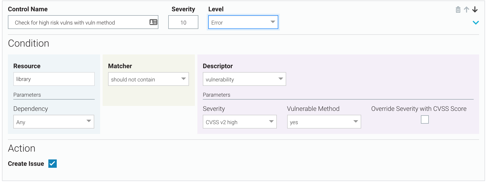
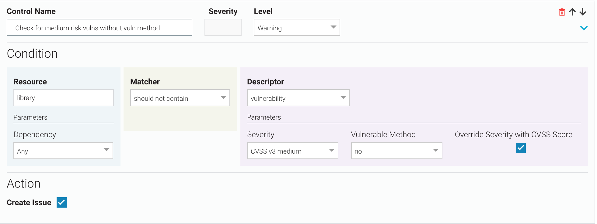
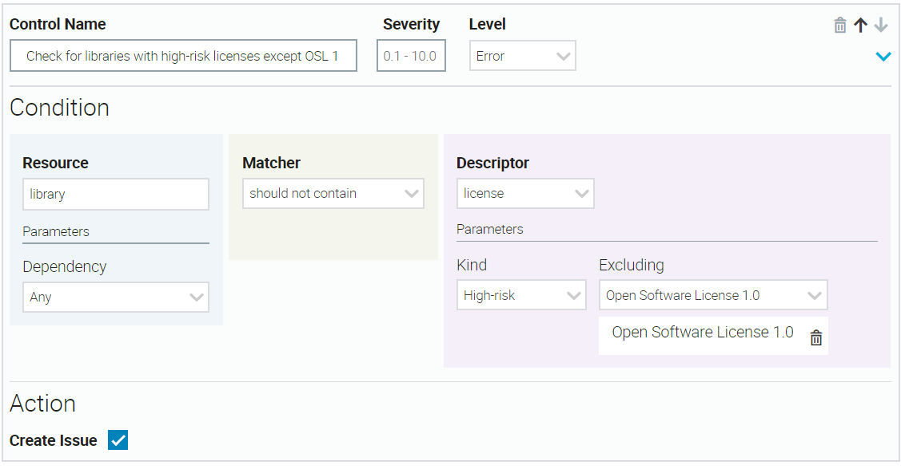
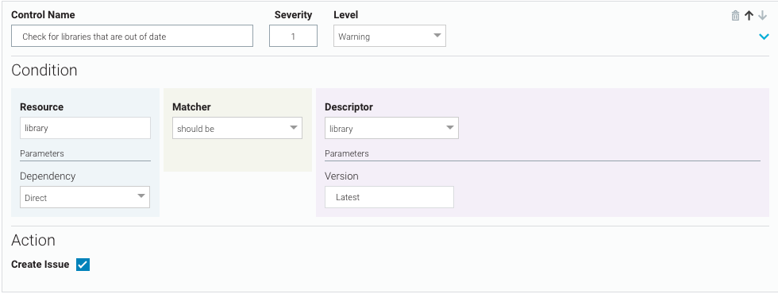

This section provides some examples of custom rules you can apply to a workspace.

**High-Risk Vulnerabilities with Vulnerable Methods**

There should be no CVSS v2 high-risk vulnerabilities where vulnerable methods are found. If there are, assign a severity of 10, break the build, and create a Veracode SCA issue.

**Medium-Risk Vulnerabilities Without Vulnerable Methods**

There should be no CVSS v3 medium-risk vulnerabilities where vulnerable methods are not found. If there are, use the CVSS score of the vulnerabilities as the control severity, do not break the build, but do create a Veracode SCA issue.

**Allow Low-Risk Vulnerabilities Without Vulnerable Methods**

If you are not interested in tracking low-risk vulnerabilities where no vulnerable methods are found, you can delete any controls where `Descriptor = vulnerability`, `Severity = low risk`, and `Vulnerable Method = no`. Then at scan time, Veracode does not create SCA issues for this kind of vulnerability.

Alternatively, you can clear the **Create Issue** checkbox in a control where `Descriptor = vulnerability`, `Severity = low risk`, and `Vulnerable Method = no`. You might prefer this method if you may want to create Veracode SCA issues for this control in the future.

**High-Risk Licenses with Exceptions**

If your condition rejects libraries that contain high-risk licenses, you can select one or more specific high-risk licenses to allow. In this example, you allow one exception for Open Software License 1.0.

**Out-of-Date Libraries**

All direct libraries should be up-to-date. If any are not, do not break the build, but do create a Veracode SCA issue with `severity = 1`.

