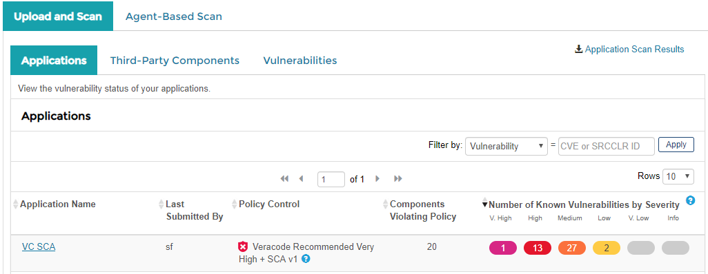
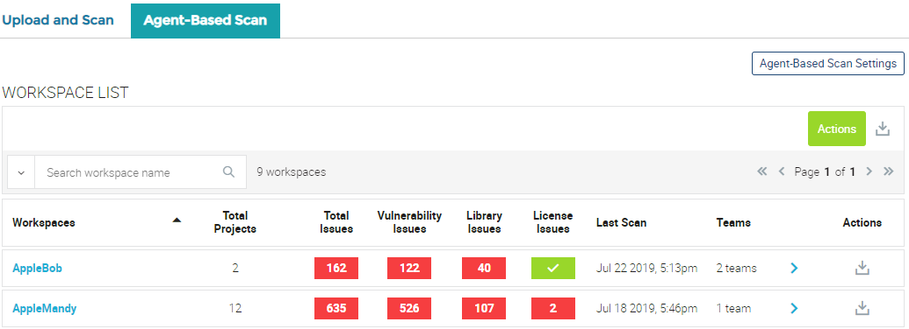

# About Veracode SCA {#c_integrated_benefits .concept}

Veracode Software Composition Analysis \(SCA\) helps you build an inventory of your third-party components to identify vulnerabilities, including open-source and commercial code.

Veracode SCA scans compile a list of libraries in an application and, then, identify the known vulnerabilities in each library. Veracode determines the list of libraries and vulnerabilities at the time of the scan. However, Veracode can also notify you of newly announced vulnerabilities that impact your applications without requiring you to perform a new scan.

Veracode SCA supports two methods of scanning that you can run at different points in the development lifecycle: scans of uploaded applications and agent-based scans.

## Upload and Scan Method {#section_gdl_mxk_43b .section}

The upload and scan method scans your application after you compile and upload the application binaries to the Veracode Platform. You can upload the binaries through the Veracode Platform user interface or by using the Veracode XML APIs. The upload and scan method allows you to perform an SCA scan at the same time as a Veracode Static Analysis or separately, if you do not have a Veracode Static Analysis subscription.

For more information about the functionality available for Veracode SCA upload scans, see [the upload scan documentation](03_upload_and_scan/c_about_SCA.md).

## Agent-Based Scan Method {#section_kgy_r1l_43b .section}

The agent-based scan method scans your code early and frequently in your software development lifecycle \(SDLC\). This method allows you to quickly scan repositories or locally cloned projects from the command line. You can also integrate agent-based scanning into your continuous integration \(CI\) pipelines. C/C++ scanning, Docker container scanning, and some additional insights, such as vulnerable methods and dependency graphs, are only available through agent-based scanning.

You can extract information about your agent-based scanning workspaces using the [SCA Agent REST API](../REST_APIs/c_sourceclear_intro.md#).

For more information about the functionality available for Veracode SCA agent-based scanning, see [the agent-based scan documentation](../02_agent_based_scans/01_accessing_sca_agent_scanning_platform.md#).

