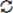
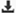

The Veracode Platform provides four reports that provide consumption data associated with your Veracode licenses: the License Used Report, Largest Scan Report, the All Scans Report, and the License Used Tier Model report. These reports track scan activity that uses your licenses for Veracode Static Analysis and Dynamic Analysis.

<b>Before You Begin</b>

- You must have the Security Lead or Administrator [role](https://docs.veracode.com/r/c_role_permissions).
- Your organization must use a licensing model that the reports support.

<b>Steps</b>

1. In the Veracode Platform, select **Analytics** > **Data Exports**.
2. Locate the report you want to generate.
3. Click the generate icon  to generate the report.
4. When the report is available, click the download icon  to download it.
   
If you do not see the automated consumption data in these reports, you may have a legacy contract term inhibiting automation. In this case, contact your Veracode account manager for assistance with managing usage reporting.
