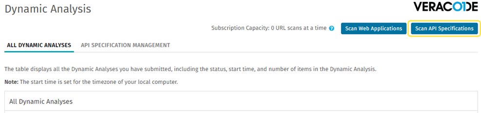
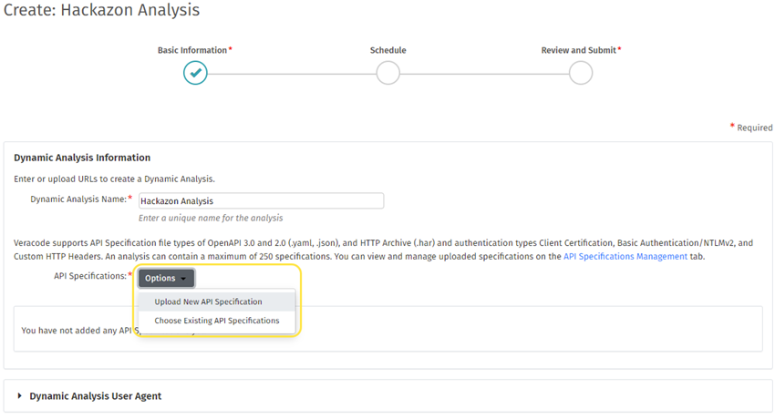

You can create an API specification scan in the Veracode Platform to perform a Dynamic Analysis of all endpoints in one or more API specifications.

<b>Before You Begin</b>

* You have a Dynamic Analysis license.
* You have a [Veracode account](https://docs.veracode.com/r/c_about_veracode_accounts) with the Creator, Submitter, or Security Lead [role](https://docs.veracode.com/r/c_role_permissions). Any member of the team associated with the Dynamic Analysis is able to view the analysis and its results.
* An API specification file that you want to scan, permissions to scan the file, any required authentication information, and, for JSON and YAML files only, the base URL at which the API is hosted. The specification file must be either OpenAPI format in well-formed, uncompressed, YAML or JSON or an HTTP Archive (HAR). For more information, see [About API Scanning and API Specifications](https://docs.veracode.com/r/About_API_Scanning_and_API_Specifications).
* If you want to [link the API scan and its scan results](https://docs.veracode.com/r/About_Dynamic_Analysis_Application_Linking) to an [application profile](https://docs.veracode.com/r/request_profile), you have [created the application profile](https://docs.veracode.com/r/t_add_application). An application profile provides scan history, flaw history, reports, policy, and analytics for a linked application. You cannot start the scan from the linked application profile, only from the Dynamic Analysis page in the Veracode Platform.

    
<b>Note:</b> The Veracode Platform only allows a single application profile to be linked to a single API specification scan or web application scan. Also, you cannot scan both API specifications and web applications using the same analysis.

<b>Steps</b>

1. Log in to the Veracode Platform.
2. Select **Scans and Analysis** > **Dynamic Analysis**.
3. Click **Scan API Specifications** to open the Create page.  
  
4. In the Dynamic Analysis Information section, enter a name for the Dynamic Analysis. Ensure the name is unique to your organization and provides a human-readable description of the analysis.
5. From the Options dropdown menu, select to upload a new API specification to scan or select an existing API specification.  
     
    You only need to upload a new specification one time and it remains available to other analyses. The specification is also available on the **API Specification Management** tab on the Dynamic Analysis page. You can use the **API Specification Management** tab to:
    - Upload and manage specifications, including renaming, reviewing configuration settings, and deleting a specification from Veracode. You can only delete specifications that are not referenced in a scan. 
    - Configure visibility settings, which specify the user roles and teams that can access the specification and scan results.
    - In the Actions column, you can click **View API Specification Details** (eye icon) to view detailed information for a given API specification. The Associated Analysis field provides a list of all scans. You can click a scan in the list to view additional information, including options for reconfiguring and rerunning the scan. 
6. For a new API specification, in the Upload API Specification window, click **Choose File**, then locate and select a valid API specification file.

    If you do not enter a name for the API specification, by default, the Veracode Platform uses the filename of the uploaded specification. Depending on the size of your specification file, the upload might take several seconds to complete. Also, the Veracode Platform shows messages about any issues with the specification, such as unsupported file format, invalid syntax, or an [issue with the relative URL](https://docs.veracode.com/r/Fixing_Relative_URLs_for_API_Scanning).

7. After the upload is complete, click **Add to Analysis** to add the specification to your new analysis. The new analysis is listed in the API Specifications to Scan table. To add additional specifications to the same analysis, repeat steps 5-7.
8. Optionally, to link the analysis and the scan results to an application profile, in the API Specifications to Scan table, in the Actions column, click **Link** (link icon). Then, select an application profile and click **Link**.
9. Optionally, in the Visibility Settings section, select which user roles or teams can access this analysis and the scan results.
10. Optionally, in the Organization Information section, enter information specific to your organization.
11. In the Scanning Certification section, select the checkbox to confirm that your organization has the required permissions to scan the specifications referenced in this analysis.
12. Click **Schedule** to specify [when you want the analysis to run](https://docs.veracode.com/r/t_was_schedule), including whether to run a prescan, or click **Review and Submit** and **Save**. A prescan scans each API to verify that Veracode can successfully reach and, if required, authenticate with the target API server.
13. [Configure the API specification scan](https://docs.veracode.com/r/Configure_and_Run_an_API_Specification_Scan).

<table class="veracode">
<thead><caption>Column Descriptions for API Specifications to Scan</caption><tr>
<th>Column</th>
<th>Description</th>
</tr>
</thead>
<tbody>
<tr>
<td>Server</td>
<td>Fully-qualified base URL for the specification. Does not apply to HAR files.</td>
</tr>
<tr>
<td>API Specification Name</td>
<td>Specification name you entered when uploading the specification.</td>
</tr>
<tr>
<td>File Type</td>
<td>File type of your API specification: OpenAPI 2.0, OpenAPI 3.0, or HTTP Archive (HAR).</td>
</tr>
<tr>
<td>Uploaded</td>
<td>Timestamp and Veracode username of the user that uploaded the specification.</td>
</tr>
<tr>
<td>Application Name</td>
<td>Name of the Veracode application profile to which this scan is linked, if configured.</td>
</tr>
<tr>
<td>Internal Scanning</td>
<td>Name of the <a href="https://docs.veracode.com/r/c_using_ism">Internal Scanning Management (ISM)</a> gateway, if configured. Veracode uses ISM to scan private APIs behind a firewall.</td>
</tr>
<tr>
<td>Actions</td>
<td>Options for configuring the specification scan, linking it to an application profile, or removing it from the current analysis. Because more than one analysis can reference the same specification, removing the specification from this table does not delete it from Veracode. To delete a specification from Veracode, in the Veracode Platform, go to <strong>Scans and Analysis</strong> > <strong>Dynamic Analysis</strong> > <strong>API Specification Management</strong> tab and use the actions in the API Specification Management table.</td>
</tr>
</tbody>
</table>  