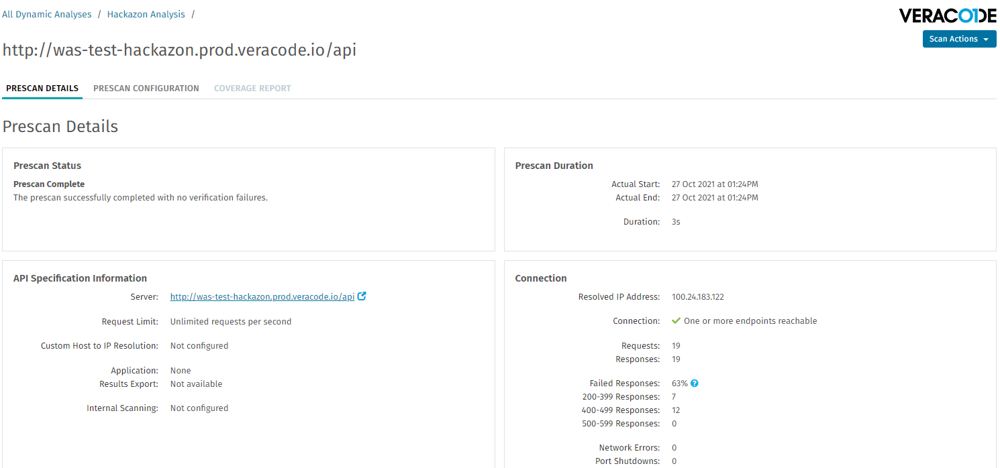
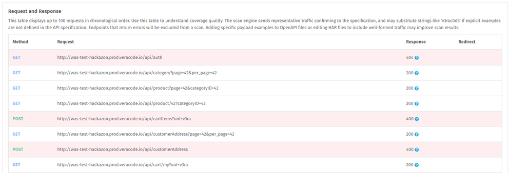

In the Veracode Platform, you can review prescan results of your scanned API specifications. The prescan results indicate whether Veracode successfully reached and, if required, authenticated with the target server for each API endpoint included in the scan.

If you ran a full Dynamic Analysis of your API specification, instead of a prescan, see [Understanding the Dynamic Analysis Coverage Report](https://docs.veracode.com/r/Understanding_the_DA_Coverage_Report).

<html>

<b>Before You Begin</b>

</html>

* You have a [Veracode account](https://docs.veracode.com/r/c_about_veracode_accounts) with the Creator, Submitter, or Security Lead [role](https://docs.veracode.com/r/c_role_permissions). Any member of the team associated with the Dynamic Analysis is able to view the analysis and its results.
* You have [created an API specification scan](https://docs.veracode.com/r/Create_an_API_Specifcation_Scan) and run a prescan.
* The scan [status](https://docs.veracode.com/r/c_was_statuses) must be Completed - Results Available.

<html>

<b>Steps</b>

</html>

1. Log in to the Veracode Platform.
2. Select **Scans and Analysis** > **Dynamic Analysis**.
3. In the All Dynamic Analyses table, click the analysis name.
4. Under API Specifications List, locate your specification.
5. Select **View Prescan Details** from the dropdown menu in the Actions column to open the Scan Details page.
      
   The Prescan Details page provides detailed information about the prescan, such as [status](https://docs.veracode.com/r/c_was_statuses) and any scan configuration [errors](https://docs.veracode.com/r/c_prescan_faillure) that you might need to correct before running a full scan. It also provides authentication and connection information that each request uses to access your target API server.  
     
   In the Request and Response section, you can review the requests to the endpoints included in the prescan. To ensure optimal performance, prescan only includes the first 100 endpoints from the specification. Requests in error are highlighted red with an error code in the Response column. Using the traffic defined in the specification, the prescan evaluates these requests to:
    * Test the connectivity to the API server, particularly if the server is behind a firewall and you have configured an ISM gateway.
    * Verify the authentication method for accessing the server. For example, a 401 in the Response column might indicate an authentication problem for that request.
6. Optionally, at the top of the page, select the **SCAN CONFIGURATION** tab to view a summary of the API specification scan. You can download the uploaded specification in its original format or download the [converted HAR file](https://docs.veracode.com/r/About_API_Scanning_and_API_Specifications).
