 
<b>Note:</b> This topic is for the new Veracode Static for Visual Studio released April 2022. For the legacy versions of Veracode Static for Visual Studio, see <a href="https://docs.veracode.com/r/c_title_VS">Veracode Static for Visual Studio (Legacy)</a>.

## Run Scan

If this is your first scan for an application using this extension, please see the [One-Time Setup section](https://docs.veracode.com/r/One_Time_Setup_of_Veracode_Static_for_Visual_Studio) to ensure your scan is properly built and packaged for uploading to Veracode.

To start a scan, select **Run Scan**.

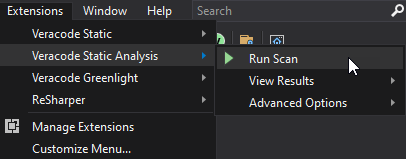

After selecting **Run Scan**, the application builds the solution with Veracode settings, packages the application, such as zipping the binaries and JavaScript, and begins the scan. The message panel displays the progress:

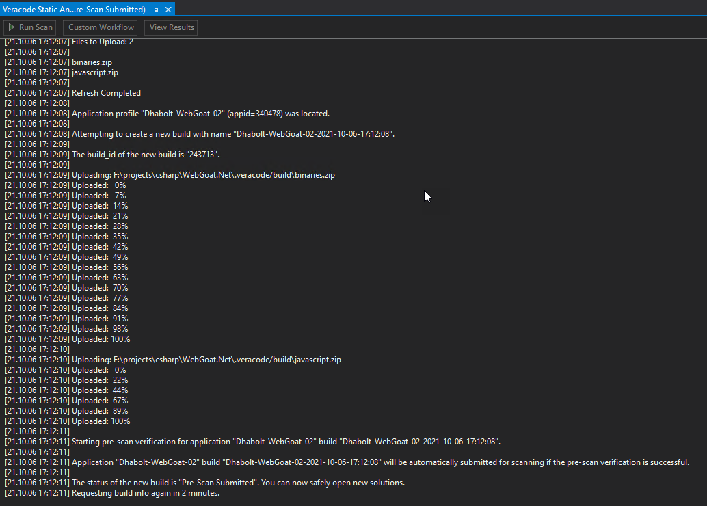

Note that the messaging panel indicates when it is safe to open new solutions and work on other applications. When the scan completes, the Summary Report displays in the message panel to let you know the results of the scan. In this case, there are multiple findings in both the binaries and the JavaScript.

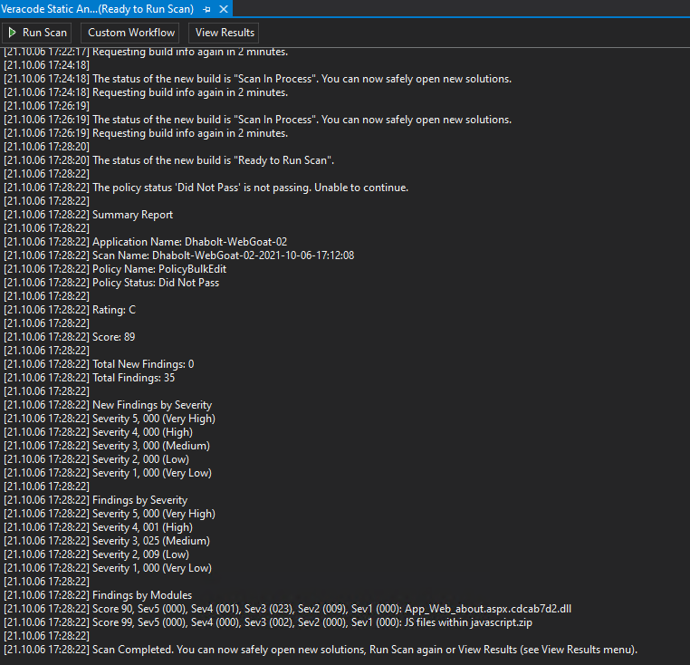

You can now click **View Results** to view full details on the findings.

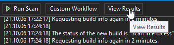

## View Results

The View Results grid opens with details about the findings.

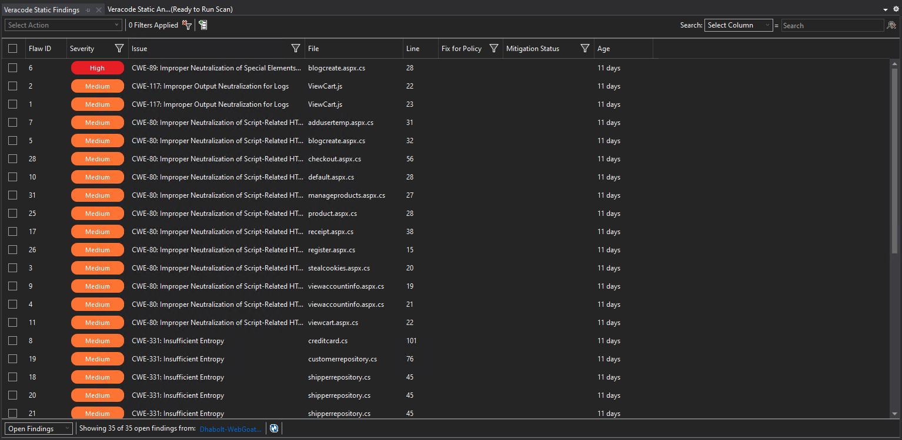

Right-click on any finding in the grid and select from these options:
- **Details**
- **History**
- **Datapaths**
- **Remediation Guidance** 
- **Go to Line** to go directly to the line of code containing the finding. You can also double-click the grid row to go directly to the source code.

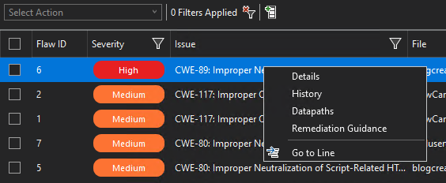

### Details

The details window shows all details for the findings. Some of these details show in the grid, by default, and the details window enables you to see all details, including the Issue Description, which gives specific guidance about the finding.

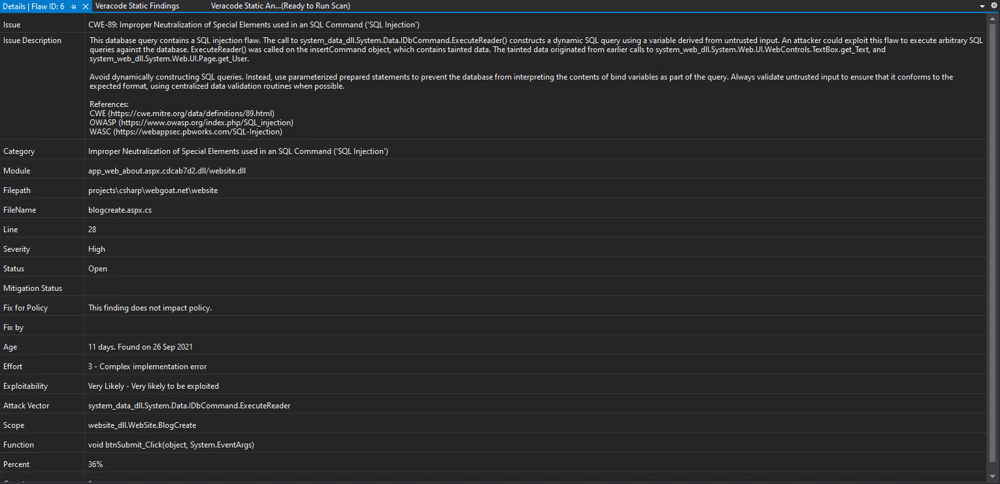

### History

The History window shows the history of any actions that have been applied to a finding, such as any mitigations, or as below, comments applied to a finding.

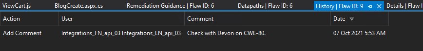

### Datapaths

The Datapaths window shows the flow of the finding through the code. In this example, there can be a number of different entry points a finding can take through the code.

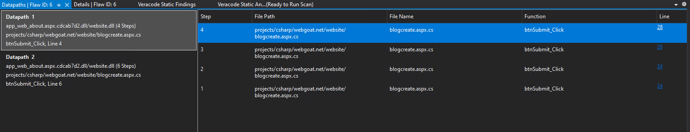

### Remediation Guidance

The Remediation Guidance window shows detailed information about a finding and examples of how it might be fixed. There are also links to other common websites with additional information on the finding, such as OWASP, WASC, and `cwe.mitre.org`.

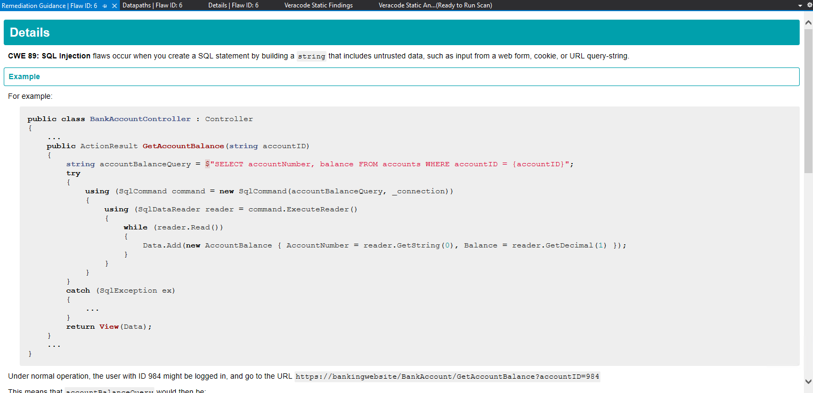

### Go to Line

You can go directly to the finding in your source code by either selecting **Go to Line**, or by double-clicking the grid row corresponding to the finding in your source code.

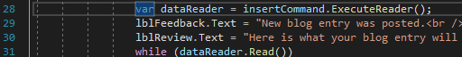

### Actions

Actions allow you to apply a number of different options for each row you select in the grid. In the example below, only one row is selected, but you can select multiple rows to which to apply the action. The actions include adding comments to the findings, adding mitigation requests, such as Mitigate by Design, Mitigate by Network Environment, etc., and with the correct account permissions, the ability to approve or reject mitigations.

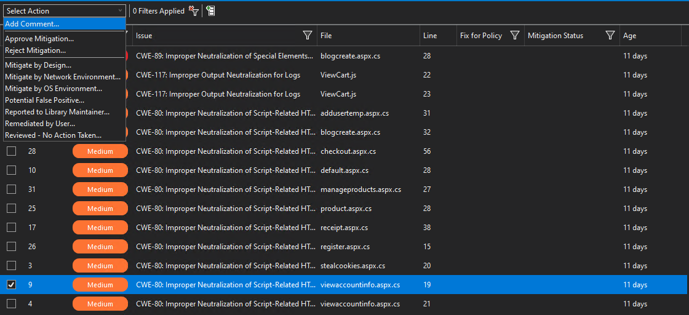

Below is an example of adding a comment to a single finding using the selected row as shown in the example above.

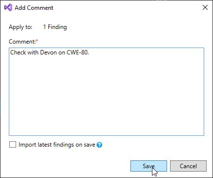

### Windows Menu

Select **Extensions** > **Veracode Static Analysis** > **View Results** > **Windows**. You can open a window for each of these menu items: **View Results**, **Finding History**, **Finding Details**, **Finding Datapaths**, and **Remediation Guidance**.

These windows are populated with data you viewed during the current Visual Studio session. If you exit and restart Visual Studio, you clear the data from all windows. If you have not viewed data in a window during the current session, the window is empty.