 <p style="background-color:#FFFCF3; padding: 12px; border-left: 5px solid #F7CD55;"><b>Note:</b> This topic is for the new Veracode Static for Visual Studio released April 2022. For the legacy versions of Veracode Static for Visual Studio, see <a href="https://docs.veracode.com/r/c_title_VS">Veracode Static for Visual Studio (Legacy)</a>.</p>

If this is your first scan with the new Veracode Static for Visual Studio extension, you might need to make small modifications to the `Veracode.Package.build` packaging file and the `veracode-build-microsoft.json` build settings file. When you run your first scan, a [wizard](https://docs.veracode.com/r/Configure_Project_Settings_for_Veracode_Static_for_Visual_Studio) opens to connect your current solution with the Veracode application name and sandbox name, if you typically scan with a sandbox.

After you finish the one-time setup, any developers that check out this solution do not have to make modifications to the build scripts. They only need to click **Run Scan**. If another developer checks out the solution for the first time, the [wizard](https://docs.veracode.com/r/Configure_Project_Settings_for_Veracode_Static_for_Visual_Studio) opens. The developer can select a default sandbox, but they cannot change the Veracode application name, which someone else set up previously. **Run Scan** proceeds to build with Veracode settings, package the artifacts, as indicated in the one time modifications to the build scripts, use the specified sandbox or policy, and complete the scan.

<p font-size="13pt"><b>Before You Begin</b></p>

- You have [Veracode API credentials](https://docs.veracode.com/r/c_api_credentials3) for accessing Veracode.
- You have configured an [API credentials file](https://docs.veracode.com/r/t_configure_credentials_windows) on Windows.

The `.veracode` directory in your solution folder is intended to be added to your `.gitignore` file to prevent from checking it in to source control.

## Use the Custom Workflow

In the extension menu, select **Advanced Options** > **Custom Workflow**.


Next, select **Build + Package** to see what you are uploading to the Veracode Platform if you do not make many changes.

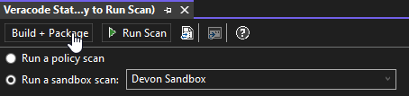

After Build + Package completes, open the temporary Veracode build output folder, which defaults to `{SolutionDirectory}/.veracode/veracode-tmp/binary`.

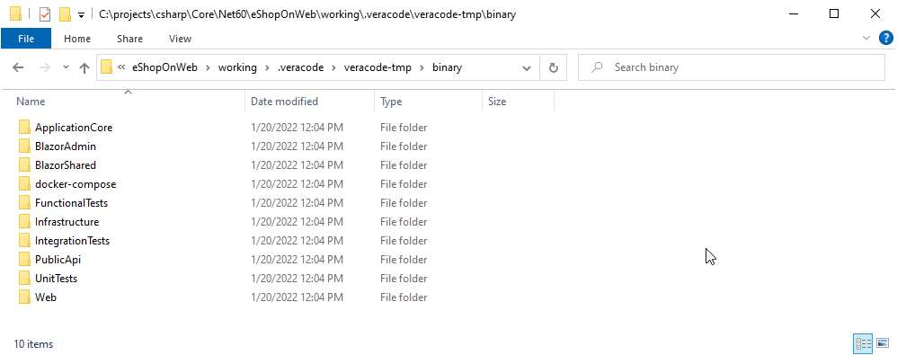

You can see a number of class library folders (e.g. `ApplicationCore` – almost always duplicated), a general `docker-compose` folder (again, with duplicate artifacts), and test class library folders, which you do not want to upload to Veracode. After analyzing the directories, it was decided that only `PublicApi` and `Web` were required. While `BlazorAdmin` is also a website, this is a monolithic application and BlazorAdmin is also contained in the main Web directory. Note that this application is the Microsoft .NET Core reference application, eShopOnWeb.

We're going to be removing the following directories before uploading to Veracode:

* `ApplicationCore`: already in `Web`
* `BlazorAdmin`: already in `Web`
* `BlazorShared`: already in `Web`
* `docker-compose`: redundant
* `FunctionalTests`: test library
* `Infrastructure`: already in `Web`
* `IntegrationTests`: test library
* `UnitTests`: test library

Next, if you open the `Web` folder and scroll to the very bottom, you see that in addition to the `Web.dll` and `Web.pdb` files, a `Web.exe` file is also generated. The `Web.exe` is a “self-contained executable” created during the .NET Core compilation process and should be removed before uploading to Veracode.

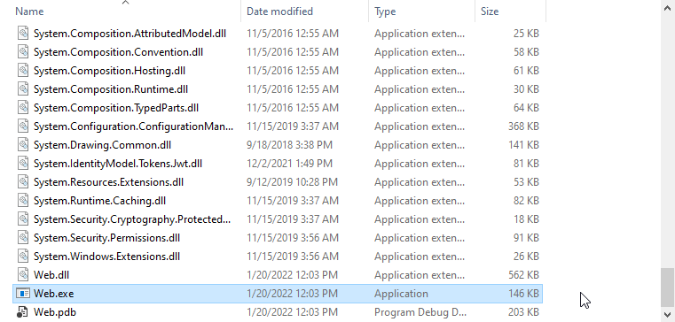

Go back to Visual Studio and open the `veracode-build-microsoft.json` file. Find the `canRemoveExecutables` property and set it to `true`. Default is `false`. This removes the `Web.exe` file from the files to be uploaded.

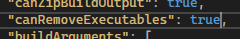

Open the `Veracode.Package.build` file and find the `VeracodeCleanBinaries` target.

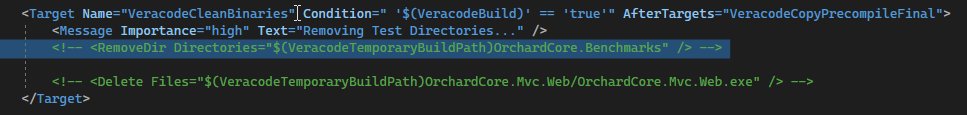

This includes a placeholder example that we're going to uncomment and copy/paste for each directory you want to remove.

```xml
<RemoveDir Directories="$(VeracodeTemporaryBuildPath)ApplicationCore" />
<RemoveDir Directories="$(VeracodeTemporaryBuildPath)OrchardCore.Benchmarks" />
<RemoveDir Directories="$(VeracodeTemporaryBuildPath)OrchardCore.Benchmarks" />
...
```

The final `VeracodeCleanBinaries` target looks like this:

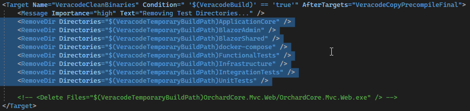

Next, if you have JavaScript to include in the artifacts you want to upload to Veracode, look for the `VeracodePackageJavaScript` target.

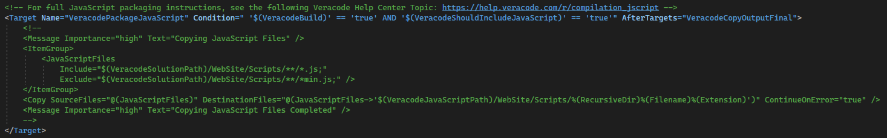

Uncomment the code and replace the `WebSite/Scripts` directory with the name of your parent directory that contains the JavaScript and any child directories with JavaScript. There is one line to include the JavaScript and one line to exclude unnecessary JavaScript (e.g. `min.js`). This is an example for eShopOnWeb:

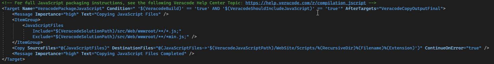

This is an example from another application (WebGoat.Net) that includes two parent directories (repeat the pattern for as many parent directories you need to include).

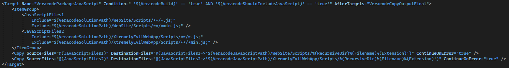

After updating the `Veracode.Package.build` script, you can run Build + Package again and sanity check your output. You see the following in the root directory of the artifacts you want to upload:

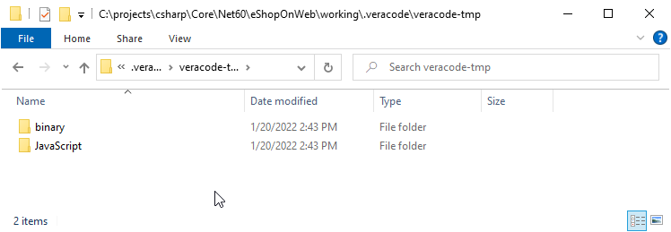

You now see that in addition to the original `binary` directory, there is a JavaScript directory. In the `binary` directory, only two directories are included in the upload to Veracode.

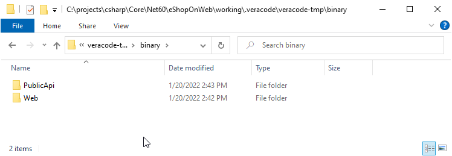

Now open the `Web` directory to confirm the `Web.exe` file has been removed, as shown in this example.

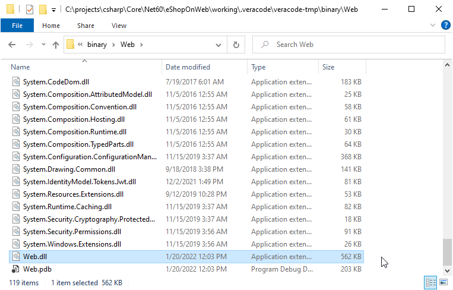

In the JavaScript directory, you see two directories containing JavaScript. One includes what appears to be third party JavaScript libraries (the `lib` directory) and you might decide to remove those. You can ignore these directories.

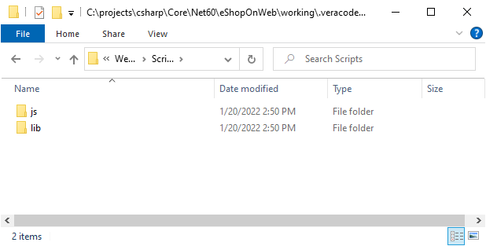

After completing the one-time setup, 99% of the time you can select **Run Scan** and all build/packaging changes take effect for anyone that checks out this solution from source control.