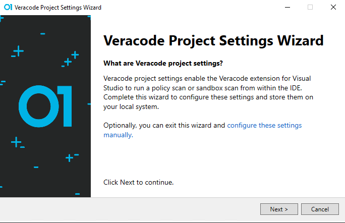
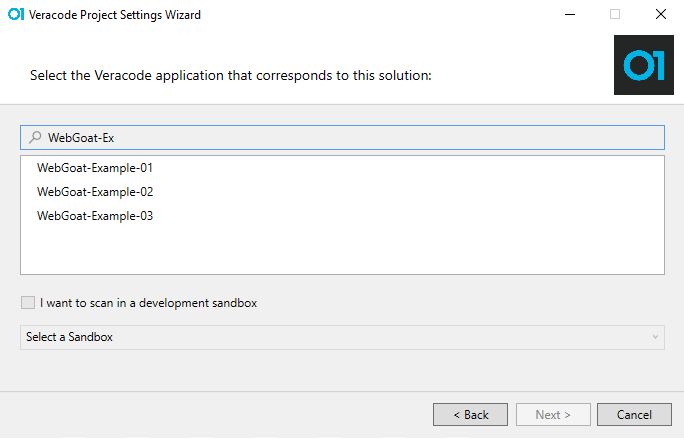
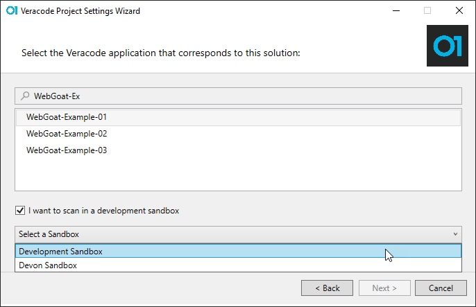
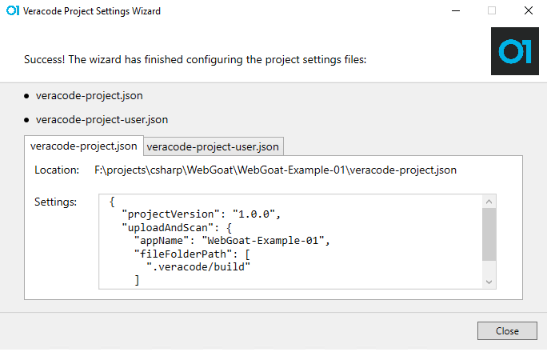
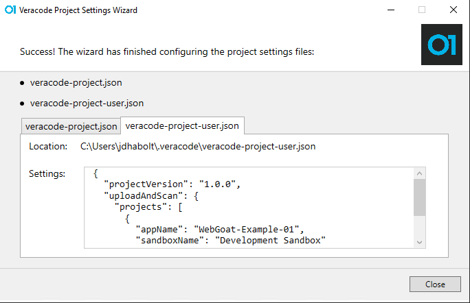

 <p style="background-color:#FFFCF3; padding: 12px; border-left: 5px solid #F7CD55;"><b>Note:</b> This topic is for the new Veracode Static for Visual Studio released April 2022. For the legacy versions of Veracode Static for Visual Studio, see <a href="https://docs.veracode.com/r/c_title_VS">Veracode Static for Visual Studio (Legacy)</a>.</p>

## The Wizard

You use the Veracode Project Settings Wizard to connect the Veracode application with the currently open solution and to configure these required files:

- `veracode-project.json`, which is in the root of the solution directory and checked into source
- `veracode-project-user.json`, which is in the same directory as the Veracode API credentials file:

   ```
   C:\Users\{UserName}\.veracode\veracode-project-user.json
   ```

If the `veracode-project.json` file does not exist when you start a scan, the wizard below opens to automatically create the project settings files for you.



## Application Selection

The first step in the wizard is to select the Veracode application to connect to this solution. Just type any part of the Veracode application name into the entry field and click on the name of the application.



## Sandbox Selection

If you intend to run most of your scans in a sandbox, you can select the **I want to scan in a development sandbox** option, and then select the sandbox for your default scan. You can select a different sandbox or a policy scan at any time through the Custom Workflow window, so you are not locked into any scan type with your choice here.



## `veracode-project.json`

After you select your Veracode application and optional sandbox, you see an example of the `veracode-project.json` file you are about to create. By default, all build output is stored in a `.veracode/build` directory in the solution directory.

 <p style="background-color:#FFFCF3; padding: 12px; border-left: 5px solid #F7CD55;"><b>Note:</b> The <code>.veracode</code> directory in your solution folder is intended to be added to your <code>.gitignore</code> file, so that you do not check it in to source control.</p>



## `veracode-project-user.json`

As mentioned elsewhere, the `veracode-project-user.json` file is created in the same directory as the Veracode API credentials:

```
C:\Users\{UserName}\.veracode\veracode-project-user.json
```

For full control of these settings, if they are only relevant to your scans, you can make additional entries in this file. These entries override the settings in the `veracode-project.json` file.



## Wizard Completion

Depending on your selection, after the wizard closes, either the scan starts or the Custom Workflow tool window opens.

## Create an Application or a Sandbox
See [Add a New Application and Sandbox From the Extension](https://github.com/veracode/static-for-vs-build-scripts/tree/dhabolt/add-veracode-app-sandbox).