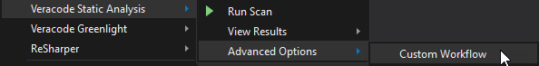
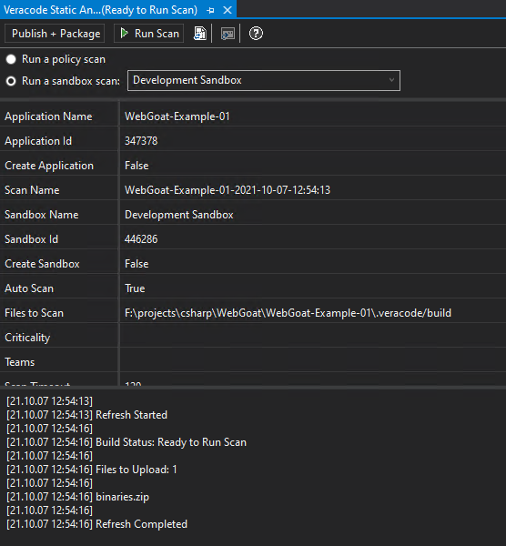
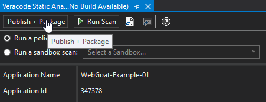
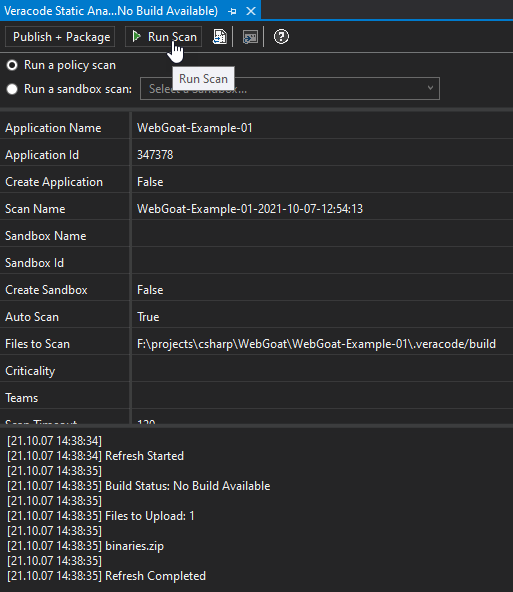
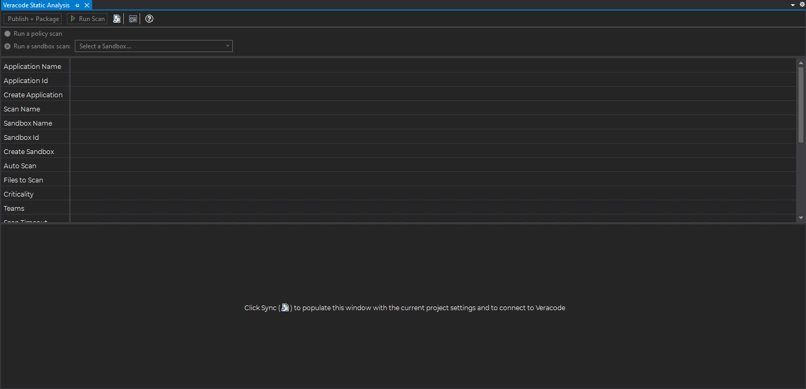
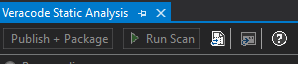

 
<b>Note:</b> This topic is for the new Veracode Static for Visual Studio released April 2022. For the legacy versions of Veracode Static for Visual Studio, see <a href="https://docs.veracode.com/r/c_title_VS">Veracode Static for Visual Studio (Legacy)</a>.

The Custom Workflow window helps you with the [one-time setup](https://docs.veracode.com/r/One_Time_Setup_of_Veracode_Static_for_Visual_Studio) or to do a one-time switch of the scan type you want to run. For example, switching from your default sandbox to a policy scan.

When the Custom Workflow window opens, it shows the current project settings. In this example, a sandbox scan with the name Development Sandbox is the default selection chosen through the [wizard](https://docs.veracode.com/r/Configure_Project_Settings_for_Veracode_Static_for_Visual_Studio).

After making your one-time changes through the Custom Workflow, you can do most of your scans by selecting **Run Scan** from the menu.

## Build/Package and Publish/Package

The **Publish + Package** option in the image below changes depending on the Visual Studio project types you have open. If you have any ASP.NET Framework applications in your solution, you see **Publish + Package**. All others show **Build + Package**.

The intent of this button in Custom Workflow is to customize what you need to upload to Veracode (through modifying the build scripts), and testing those changes using **Build/Package** until you have the right artifacts selected based on your application.

## Run Scan

Click **Run Scan** to begin a scan with the current Policy/Sandbox changes.

For example, if you want to run an occasional policy scan, but your default is for a sandbox scan, you can select **Run a policy scan**.

## Sync

When a new Visual Studio solution is opened, you do not want the extension to make any assumptions about whether the developer wants to scan using Veracode during that session. However, if either the Happy Path or Custom Workflow tool window are already opened, you see **Sync** in the area where the message panel normally displays messages.

If you click **Sync**, it loads the settings from the project system, communicates with Veracode, and prepares the tool window for running a scan.

The **Sync** button is also displayed on the Custom Workflow tool window, just after the *Run Scan* button as shown below. This has identical functionality to the button displayed above, but is typically used if changes are made to the project system behind-the-scenes, to sync the new changes to the project system.

