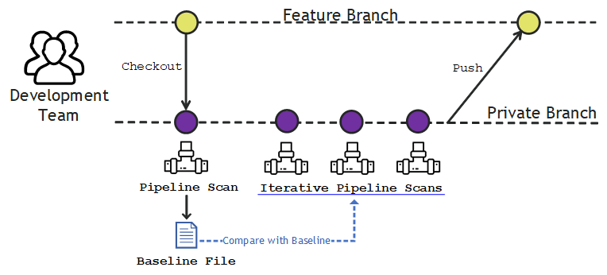

You can use Pipeline Scans to evaluate the security of your application within a development pipeline.

The Pipeline Scan directly embeds into team development pipelines and provides fast feedback on flaws introduced on new commits. You can use it to break the build based on flaw severity and CWE category. You can evaluate the changes in your results compared to previous scans, enabling you to identify security flaws present in your application before you release the application into production environments.

<b>Note:</b> Pipeline Scan does not support flaw mitigations or flaw matching. If you require these features, you can perform Veracode Static Analysis of your applications using <a href="https://docs.veracode.com/r/c_appsec_policies">security policies</a> or development sandboxes.

This example shows an initial Pipeline Scan that creates a [baseline file](06_c_about_pipeline_baseline_file.md) of known findings followed by additional scans that run iteratively against the baseline. The iterative scanning approach enables you to gradually identify and resolve new findings until those new findings no longer appear in the scan results.

