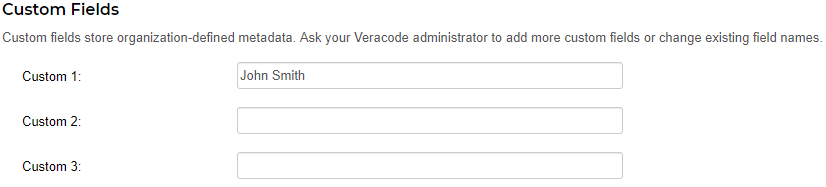
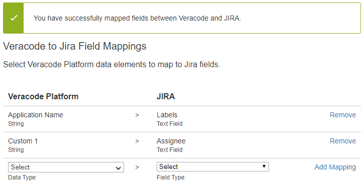
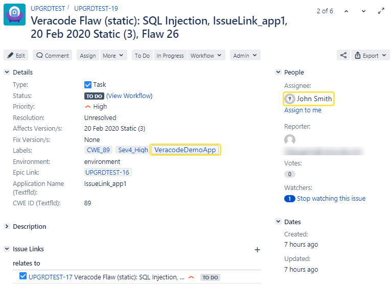

This example demonstrates mapping fields from application profiles in the Veracode Platform to fields in Jira or Jira Cloud issues.

This example creates a mapping between these fields:

-   Default field Application Name in the Veracode Platform to the Labels field in Jira or Jira Cloud.
-   Custom 1 field in the Veracode Platform to the Assignee field in Jira or Jira Cloud.

In this example, when creating the application named VeracodeDemoApp in the Veracode Platform, you edit the metadata and assign a value for custom field Custom 1. For example, enter assignee John Smith as the value.

In Jira or Jira Cloud, these field mappings are configured on the Veracode to Jira Field Mappings page:

-   The application name field is mapped to the Labels field.
-   Custom field Custom 1 is mapped to the Assignee field.

A sample issue shows the result of the field mappings:

