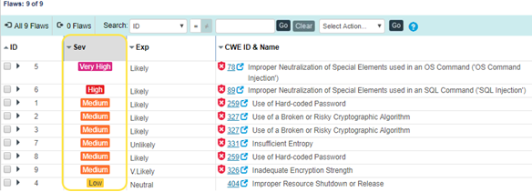
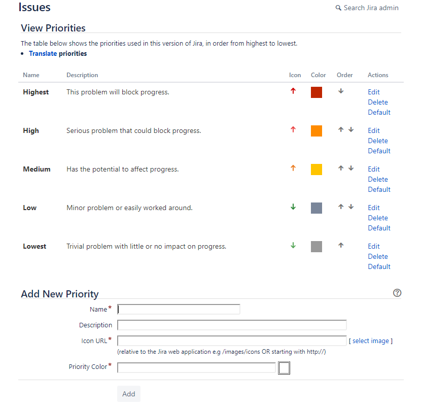
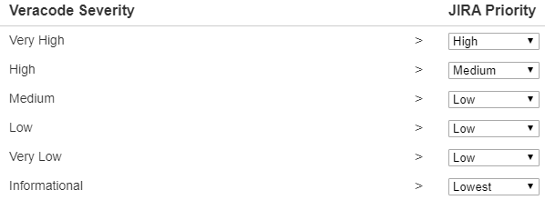
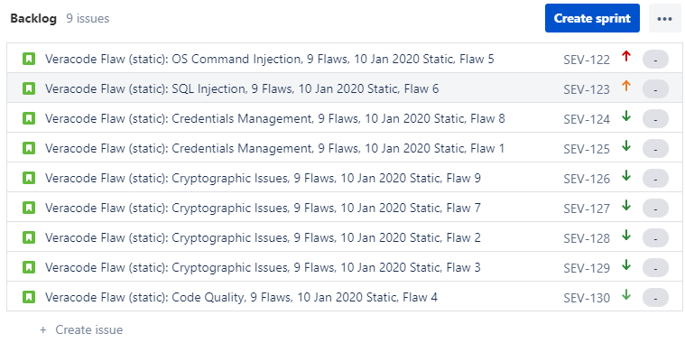
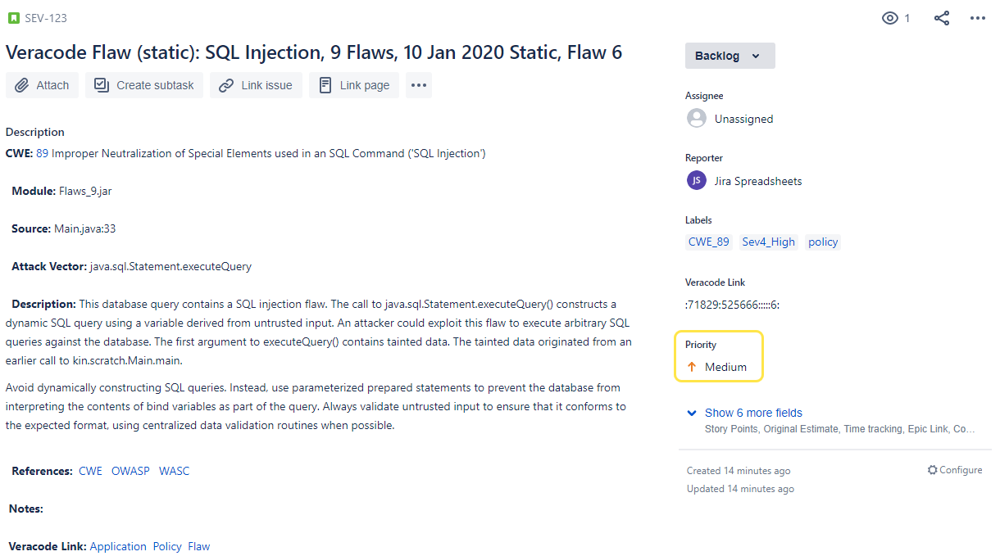

This section provides an example of using the Veracode Integration for Jira Cloud to map Veracode flaw severities in the Veracode Platform to priorities in Jira Cloud.

In this example, the Triage Flaws page in the Veracode Platform lists nine flaws with different severities: Very High, High, Medium, and Low.

In Jira Cloud, the View Priorities page lists the five default priorities, in order, with default names.

In Jira Cloud, the Veracode Integration Severity Mappings page shows these mappings:

-   The Very High severity is mapped to the **High** priority, instead of the default **Highest** priority.
-   The High severity is mapped to the **Medium** priority, instead of the default **High** priority.
-   The Medium and Very Low severities are mapped to the **Low** priority, instead of the default **Medium** and **Lowest** priorities.
-   The Low severity is mapped to the default **Low** priority.
-   The Informational severity is mapped to the **Lowest** priority.

After you import the flaws from the Veracode Platform to Jira Cloud as issues, the issues show these assigned priorities:

-   The Very High severity flaw has a High priority.
-   The High severity flaw has a Medium priority.
-   All Medium severity flaws have a Low priority.
-   The Informational severity flaw has a Lowest priority.

Clicking an issue ID link in Jira Cloud opens the Details view showing the priority value. In this example, issue SEV-123 for flaw ID 6, which has a High severity in the Veracode Platform, has a Medium priority in Jira Cloud.

