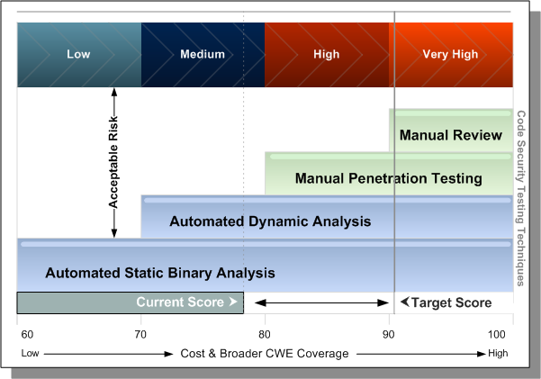

Veracode is the only on-demand provider in the marketplace to offer a full application risk management solution. This solution includes an application inventory definition and an application security policy that provides multiple analysis methods and standard security ratings.

## About Application Risk Management

Risk management is the process that allows IT managers to balance the operational and economic costs of protective measures and achieve gains in mission capability by protecting the IT systems and data that support their organizations' missions. Overall risk management encompasses three processes: risk assessment, risk mitigation, and evaluation and assessment. The tasks in this section detail best practices for implementing a successful software risk management program.

## Task 1 - Application Risk Assessment: Assess Business Criticality Across Portfolio

While it may seem obvious that as part of a risk assessment organizations need to create a portfolio of their applications that are being developed, purchased, or maintained by an outsourcing provider, in practice it is a challenging exercise. With the advent of low-cost offshore development, open source and low-cost commercial software it is common to see application "sprawl" as individual groups or business units may have contracted work that previously would have required higher capital costs and formal approvals. When conducting an application inventory, involve business units, procurement and vendor management to ensure all software that was or is entering the organization has been identified.

Once applications have been identified, organizations need to understand the risk that the application poses to the business. This can be achieved through the assignment of a [business criticality](https://docs.veracode.com/r/review_assurancelevels) for each application based on business risk factors, such as:

-   Reputation damage
-   Financial loss
-   Operational risk
-   Sensitive information disclosure
-   Personal safety
-   Legal violations

Business Criticality is used to determine the extent of testing methods, such as more business-critical applications may be tested using multiple techniques. The overall acceptance criteria, such as lower criticality applications may be accepted with lower security scores as they do not pose a significant risk to the business.

## Task 2 - Define Application Security Policies

The business criticality selected for an application determines the application security policy required for the application. Defining an application security policy consists of these steps:

1. Select Appropriate Analysis Methods and Scanning Frequency
2. Use Industry Standard Security Scores
3. Define Appropriate Remediation Periods
4. Set Policies for Acceptable Thresholds
5. Select An Appropriate Application to Scan

### Select Appropriate Analysis Methods and Scanning Frequency

Applications with higher business criticality require more comprehensive analysis for Veracode to accurately score their security quality. Because each analysis technique \(automated static, automated dynamic, manual penetration testing or manual review\) has differing false negative \(FN\) rates for different types of security flaws, any single analysis technique or combination of techniques produces a certain level of false negatives. Some false negatives are acceptable for lower business criticality applications, so a less expensive analysis, using only one or two analysis techniques, is acceptable. At higher business criticality the FN rate should be close to zero, so Veracode recommends multiple analysis techniques.

In this image, higher business criticality applications require multiple testing techniques to provide an acceptable level of risk to the organization:

As the business criticality of an application increases, multiple analysis techniques should be used to assess its security quality.

### Use Industry Standard Security Scores

Until recently, each security solution provider assessed the severity of vulnerabilities according to their own, proprietary system. This led to discrepancies between products and services, and limited the value of security assessments. In 2005, a coalition of security experts created the Common Vulnerability Scoring System \(CVSS\), a vendor-agnostic standard for communicating the severity of vulnerabilities to help businesses prioritize decisions about which flaws to fix.

Veracode combines the CVSS for severity and ease of exploitability with other industry standards, including the MITRE Common Weakness Enumeration \(CWE\) for classification of software weaknesses to provide an overall application security rating. Veracode is the only organization to combine these standards into a meaningful and practical way to assess software security across internally and externally developed applications.

To determine a Security Quality Score \(SQS\), Veracode aggregates the severities of all security flaws and normalizes to a scale of 0 to 100, where 100 is a perfect score. Veracode then uses the score that a particular type of testing \(automated static, automated dynamic, or manual\) generates, including the business criticality of the application requirements, to compute the Veracode Level of that application for each testing technique.

### Set Policies for Acceptable Thresholds

Veracode provides an overall Veracode Level based on the Security Quality Score \(SQS\), severity of flaws found, and scans performed, in the form of a simple-to-understand level from Veracode Level 1 to Veracode Level 5. This provides businesses with the ability to set policies for acceptable thresholds based not only the number and severity of vulnerabilities in the software, but the risk that application poses to the business. 

The type of testing you perform on the application and the severity and types of flaws detected determine its Veracode Level \(VL\). Each VL requires a minimum security score.

### Select an Appropriate Application to Scan

When deciding which applications to scan, refer to [the list of languages and platforms](https://docs.veracode.com/r/r_supported_table) that Veracode supports for Static Analysis and the [guidelines for Dynamic Analysis scans](https://docs.veracode.com/r/c_was_intro).